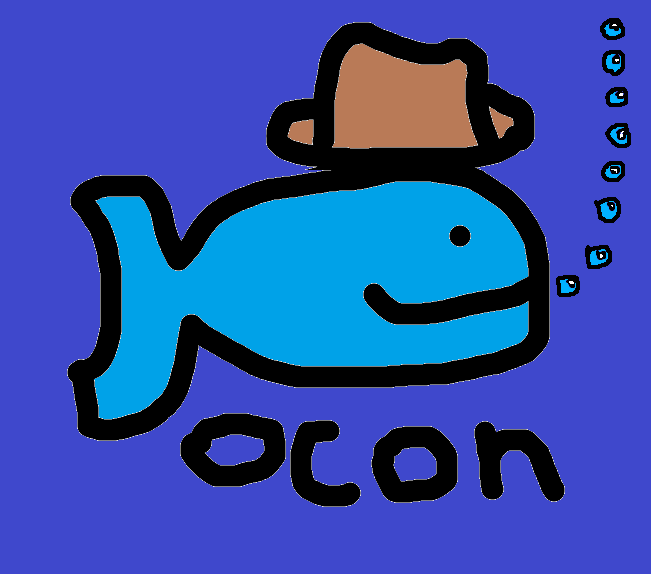

# OCON

## About
Ocon is my programing language possibly the worst ever made. 🐟
It is made mostly by me using golang

OCON does not use an [AST](https://en.wikipedia.org/wiki/Abstract_syntax_tree), and I probably won't add one in the future because switching to one would be difficult at this point. When I started the project, I didn't even know ASTs existed, so OCON's interpreter developed around a different approach.


> **Platform:** Ocon currently supports Windows only.  
> A port to macOS and Linux may be possible in the future.

## Current (semi-working) Features

- Variables
- Arithmetic
- Boolean operations
- Conditionals
- Sections
- Goto command
- Math functions
- Comments
- Return functions

## Hopefuly new Features to come

- Reflection
- Imports
- a way to install and update ocon

## Egg samples of Ocon

### Hello world:
```ocon
echo Hello_world!
```

### increment:
```ocon
var "i '0

§ "loop

increment "i '1
echo $i

if [ isless $i '5 ] goto "loop else continue
```

### full test script:
See Test script.ocon

## How to run Ocon

```shell
ocon execute "filename.ocon"
```

## Building
Want the `.exe`? Build it yourself.

You're smart. All you need is a Go compiler.

```sh
go build
```

## More
This README was made only by me no AI. Sorry if there were any spelling mistakes I can't spell good.

## Contact me
<oscarfoxpatterson@gmail.com>
0thisisauser \<-- Use this one

## Icon
